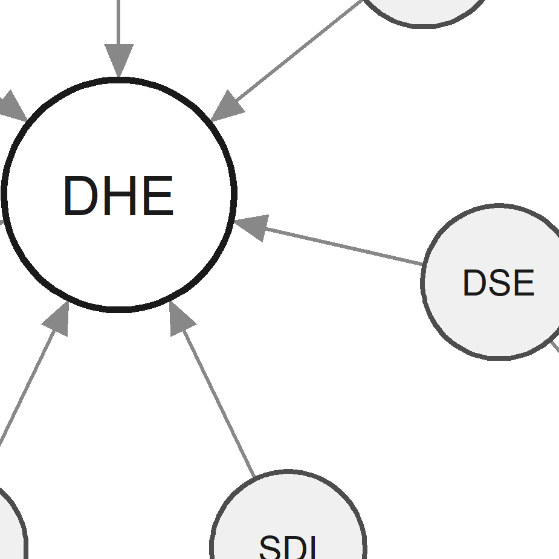

{width="20%" style="border-radius: 8px; margin-bottom: 1.5rem;"}

## Digital Health Inequality

Digital health interventions --- including apps, wearables, online programmes, and telehealth services --- offer significant potential to improve health outcomes and extend the reach of healthcare. Yet the benefits of these technologies are not equally distributed. Individuals from lower socioeconomic groups are consistently less likely to engage with and benefit from digital health tools, a pattern that risks deepening existing health inequalities rather than reducing them.

Understanding *why* these disparities exist requires moving beyond access alone. Factors such as digital skills, health literacy, self-efficacy, trust, and social norms all shape whether an individual can meaningfully engage with digital health --- yet no validated instrument existed to measure these factors in combination.

::: {.callout-note appearance="minimal" icon=false}
## What is Digital Health Enablement?

Digital Health Enablement refers to the constellation of individual-level factors 
that determine whether a person is positioned to meaningfully engage with and 
benefit from digital health interventions. It encompasses the skills, knowledge, 
motivation, and social context that shape an individual's capacity to use digital 
health tools effectively.
:::

## The Project

The Digital Health Enablement (DHE) project is a programme of doctoral research based at the **University of Bath**, addressing this gap through the development and validation of a new psychometric instrument: the **Digital Health Enablement Scale (DHES)**.

The project comprises three interconnected studies:

-   **A scoping review** of the mechanisms underlying socioeconomic disparities in digital health outcomes, establishing the evidence base for the DHE model
-   **A qualitative study** involving semi-structured interviews to explore enablement from the perspective of individuals with lived experience of digital health inequalities
-   **A Delphi and validation study** to establish content validity of the DHES and examine its psychometric properties in a UK adult sample

