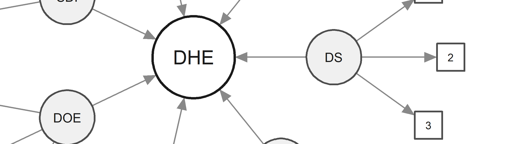
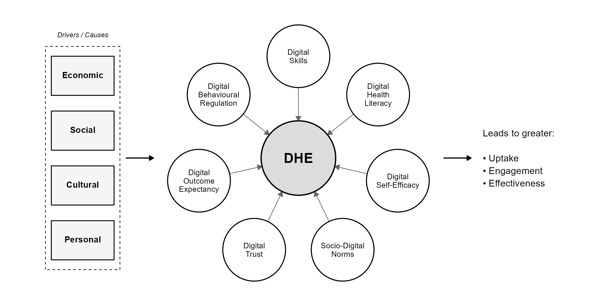

The Digital Health Enablement (DHE) model proposes that an individual's capacity to benefit from digital health interventions is shaped by seven inter-related domains. These domains capture the cognitive, motivational, social, and behavioural factors that determine whether a person can meaningfully engage with digital health tools.

The model situates these domains within a broader context of structural drivers --- economic, social, cultural, and personal factors --- that shape enablement upstream. Together, greater enablement across these domains is theorised to predict improved uptake, engagement, and effectiveness of digital health interventions.

{width="100%" fig-alt="A hub and spoke diagram showing the seven domains of the DHE model surrounding a central Digital Health Enablement node, with structural drivers on the left and outcomes on the right."}
