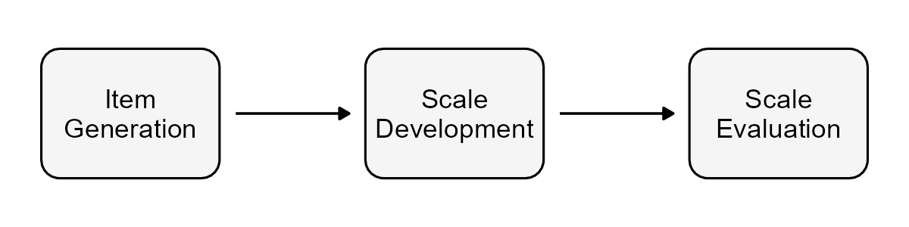

## Overview

The Digital Health Enablement Scale (DHES) is a self-report psychometric instrument designed to measure an individual's capacity to engage with and benefit from digital health interventions. It operationalises the seven domains of the [DHE model](dhe-model.qmd), capturing the cognitive, motivational, social, and behavioural factors that underpin meaningful digital health engagement.

{width=80%}

The scale is designed for use with adult populations in research and clinical contexts, with particular relevance to settings where digital health inequalities are a concern --- including primary care, public health, and weight-related behaviour change programmes.

## Development

The DHES was developed through a rigorous mixed-methods process grounded in established frameworks for scale development. Development involved:

::: {.callout-tip appearance="minimal" icon=false}
**Current stage:** Full scale testing with UK adult sample
:::

| Date | Description | Status | Ethics Reference |
|-------|-----------------------------|--------|------|
| May 2024 | A **Scoping review** of mechanisms explaining socioeconomic disparities in digital health outcomes | 🟢 Complete | N/A |
| Jun 2024 | A **Literature review** of existing digital health scales to identify gaps and inform item development | 🟢 Complete | 1447 |
| Sep 2024 | **Proto-model development** from existing theory | 🟢 Complete | 1447 |
| Nov 2024 | **Semi-structured interviews** with users on digital health experiences | 🟢 Complete | 1447 |
| Jan 2025 | **Delphi study** with subject matter experts to establish content validity | 🟢 Complete | 1447 |
| Mar 2025 | **Cognitive interviews** with users on the draft scale | 🟢 Complete | 6276 |
| Apr 2025 | **Pilot study** of the draft DHES | 🟢 Complete | 6276 |
| **May 2025** | **> Full scale testing with UK adult sample <** |🔵 **Underway**| 6276 |
| TBC 2026 | **Psychometric evaluation** of structural validity and measurement properties | 🟡 Planned | — |
| TBC 2027 | **Validation study** examining convergent, divergent, and criterion validity | 🟡 Planned | — |

: **Table 1** Project Timeline

## Current Status

The DHES is currently undergoing peer review. A full validation study examining the scale's structural validity, reliability, and convergent validity in a UK adult sample is ongoing.

The scale is not yet publicly available. Researchers interested in the DHES --- including those wishing to collaborate or discuss potential applications --- are warmly encouraged to [get in touch](contacts.qmd).

## Availability

Full details of the scale, including items, scoring instructions, and psychometric properties, will be made available on this page following publication.
